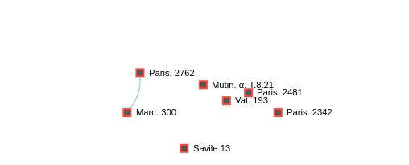
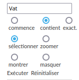
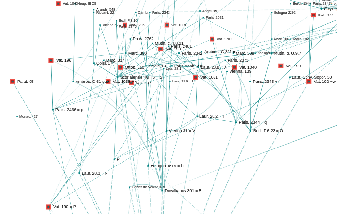
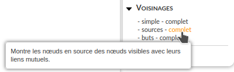
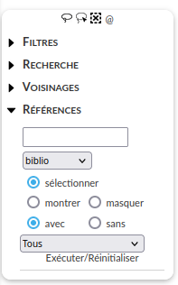

.. include:: substitutions.rst

Bandeau droit
#############

Barre de menu
=============

Montrer au lasso
----------------

.. figure:: _static/images/fr/menu_droit_lasso_selection.png
   :align: center

|arrow|

   Montre uniquement les nœuds entourés au lasso

Sélectionner au lasso
---------------------
.. figure:: _static/images/fr/menu_droit_lasso_selectionner.png
   :align: center

.. figure:: _static/images/fr/menu_droit_lasso_selection.png
   :align: center

|arrow|

   Sélectionne les nœuds entourés au lasso

Dé-sélectionner
---------------

   Dé-sélectionne tous les nœuds sélectionnés

@
-

   Copie dans le presse-papier une url donnant accès à la vue actuelle.

Il est ainsi possible d’insérer dans un texte en ligne un lien vers n’importe quelle partie du graphe.

Filtres
=======

Les filtres montrent ou masquent des nœuds et des liens choisis.

Avec/Sans notice
----------------

   Nœuds et liens avec notice

.. figure:: _static/images/fr/menu_droit_sans_notice.png
   :align: center

   Nœuds et liens sans notice

Nœuds
-----

Inverser
^^^^^^^^
Masque les nœuds visibles et montre les nœuds masqués.

|arrow|

Sélection : montrer
^^^^^^^^^^^^^^^^^^^

|arrow|

Sélection : masquer
^^^^^^^^^^^^^^^^^^^

|arrow|

Sélection : inverser
^^^^^^^^^^^^^^^^^^^^

|arrow|

Sélection : terminaux - initiaux
^^^^^^^^^^^^^^^^^^^^^^^^^^^^^^^^

Pour un ensemble de nœuds sélectionnés, les nœuds terminaux (resp. initiaux) sont ceux qui n’ont aucun nœud en but (resp. source) parmi ceux sélectionnés.

|arrow|

.. figure:: _static/images/fr/menu_droit_terminaux_output.png
   :align: center

Par exemple, si les nœuds sélectionnés sont ceux avec le mot-clef “D5 = NC”, c’est-à-dire ceux pour lesquels l’axiome des parallèles est une Notion Commune, les nœuds terminaux sont ceux qui satisfont cette condition mais dont l’origine de cette caractéristique n’a pas été identifiée (ou enregistrée…) dans le graphe.

Pour chaque aspect conféré par transmission, les nœuds terminaux  sont ceux dont le graphe ne rend pas compte de l’origine. Ils renseignent sur la complétude du graphe et sont un moyen de contrôle des données enregistrées.
Sélection : annuler

“Initiaux” ne garde que les nœuds sélectionnés qui n’ont pas de nœuds sélectionnés en source ayant tous leurs mots-clefs.

|arrow|

annuler
^^^^^^^

“annuler” dé-sélectionne les nœuds sélectionnés.

En ligne/pas en ligne
^^^^^^^^^^^^^^^^^^^^^

“En ligne” montre uniquement les nœuds dont le texte est en ligne.

“Pas en ligne” montre uniquement les nœuds dont le texte n’est pas en ligne.

Isolés/non isolés
^^^^^^^^^^^^^^^^^

“isolés” montre uniquement les nœuds isolés.

“non isolés” montre uniquement les nœuds avec un lien.

Avec/sans vignette
^^^^^^^^^^^^^^^^^^

“Avec (resp. sans) vignette” montre uniquement les nœuds avec (resp. sans) vignette. Une vignette est l’image qui s’affiche quand on clique sur un nœud.

Types
^^^^^

Les noeuds ayant tous le même type (Biblio), cette fonctionnalité ne s’applique pas à ce graphe.

Liens
-----

Masquer tous les liens
^^^^^^^^^^^^^^^^^^^^^^

|arrow|

seulement - sauf
^^^^^^^^^^^^^^^^

“Seulement” ne montre que les nœuds ayant un lien du type sélectionné.

   Nœuds ayant un lien de type "parenté"

“Sauf” montre tous les nœuds sauf ceux ayant un lien du type sélectionné.

.. figure:: _static/images/fr/menu_droit_sauf_output.png
   :align: center

   Nœuds ayant un lien autre que "parenté"

Réinitialiser
^^^^^^^^^^^^^

Revient à l’état initial du graphe.

Recherche
=========

Nœuds
-----

Champ de recherche
^^^^^^^^^^^^^^^^^^

Le champ de recherche permet de sélectionner, de zoomer, de montrer ou de masquer les nœuds ayant un mot qui commence, contient ou est exactement une chaîne donnée.

La recherche se fait sur :

- le nom ;
- le titre ;
- l’éditeur ;
- le lieu d’édition ;
- la langue ;
- l’année ;
- les mots-clefs ;
- les urls.

Le contenu des notices n’est pas pris en compte dans la recherche.

Pour sélectionner les nœuds contenant une chaîne commençant par “Vat.” :

   Nœuds contenant une chaîne commençant par “Vat.”

Il est possible de mettre n’importe quelle formule propositionnelle dans le champ de recherche.

- & : et
- |stroke| : ou
- ! : non

La recherche de la chaîne “latin & (Paris | Venise)” sélectionne les noeuds contenant la chaîne “latin” et la chaîne “Paris” ou “Venise” :

   Résultat pour  “latin & (Paris | Venise)”

La recherche de la chaîne “Strasbourg & ! Clavius” sélectionne les noeuds contenant la chaîne “Strasbourg” et ne contenant pas la chaîne “Clavius” :

   Résultat pour  “Strasbourg & ! Clavius”

Mots-clefs
^^^^^^^^^^

Ctrl + Clique sur un mot-clef en donne la définition :

   Définition du mot-clef "VI.33 ajout : texte"

Mots-clefs communs
^^^^^^^^^^^^^^^^^^

.. figure:: _static/images/fr/menu_droit_recherche_mots-clefs_communs.png
   :align: center

Affiche la liste des mots-clefs communs aux nœuds sélectionnés parmi les mots-clefs sélectionnés.

   Mots-clefs communs à v et S parmi les 4 mots-clefs sélectionnés

Affiche la liste des mots-clefs communs aux nœuds sélectionnés si aucun mot-clef n’est sélectionné. Les mots-clefs communs sont sélectionnés dans le champ déroulant des mots-clefs du bandeau de gauche.

   Mots-clefs communs à v et S

Innovants - orphelins
^^^^^^^^^^^^^^^^^^^^^

“Innovants” sélectionne les nœuds innovants pour un des mots-clefs sélectionnés, c’est-à-dire les nœuds dont aucun nœud en but n'a l’un des mots-clefs sélectionnés.

On peut commencer par sélectionner les nœuds avec le mot-clef D5=D :

   Nœuds avec le mot-clef D5=D

"Innovants" sélectionne alors ceux qui n'ont pas de modèle avec ce mot-clef ; c'est-à-dire les textes qui "introduisent" cet aspect (relativement aux informations enregistrées).

   Nœuds innovants pour le mot-clef D5=D

Inversement, "orphelins" sélectionne les nœuds qui n'ont pas de descendant direct avec ce mot-clef ; c'est-à-dire les textes sans postérité sur cet aspect (relativement aux informations enregistrées).

   Nœuds orphelins pour le mot-clef D5=D

Les mêmes choses s'appliquent aux mots-clefs exclus (ceux que les nœuds *n*'ont *pas*) :

.. figure:: _static/images/fr/menu_droit_recherches_mots-clefs_D5=D_exclus_innovants_pointeur.png
   :align: center

   Nœuds *n*'ayant *pas* le mot-clef D5=D

   Nœuds innovants *n*'ayant *pas* le mot-clef D5=D

On peut aussi déterminer les nœuds orphelins parmis ceux qui *n*'ont *pas* le mot-clef D5=D :

   Nœuds *n*'ayant *pas* le mot-clef D5=D

   Nœuds orphelins *n*'ayant *pas* le mot-clef D5=D

Liens
-----

Le champ de recherche permet de sélectionner, de zoomer, de montrer ou de masquer les liens dont les types ont un mot qui commence, contient ou est exactement une chaîne donnée.

*Le contenu des notices sur les liens n’est pas pris en compte dans la recherche.*

   Sélection des liens avec "Parenté"

.. figure:: _static/images/fr/menu_droit_recherche_liens_monter_Parente_output.png
   :align: center

   Montre uniquement les liens avec "Parenté"

.. figure:: _static/images/fr/menu_droit_recherche_liens_monter_Parente_ou_Copie_pointeur.png
   :align: center

   Montre uniquement les liens avec "Parenté" ou "Copie"

Voisinages
==========

Montre le voisinage des nœuds visibles.

simple
------

|arrow|

   Voisinage simple des nœuds initialement visibles

complet
-------

|arrow|

   Voisinage complet des nœuds initialement visibles

sources
-------

.. figure:: _static/images/fr/menu_droit_voisinages_sources.png
   :align: center

|arrow|

   Voisinage en sources des nœuds initialement visibles

sources complet
---------------

|arrow|

   Voisinage en sources complet des nœuds initialement visibles

buts
----

|arrow|

.. figure:: _static/images/fr/menu_droit_voisinages_but_output.png
   :align: center

   Voisinage en buts des nœuds initialement visibles

buts complet
------------

.. figure:: _static/images/fr/menu_droit_voisinages_buts_complet.png
   :align: center

|arrow|

   Voisinage en buts complet des nœuds initialement visibles

Références
==========

Les fonctions du menu “Références” permettent de sélectionner, montrer ou masquer les nœuds et les liens avec ou sans références associées du type choisi (biblio, personnes, institutions ou revues) suivant un type de lien choisi (Etude sur, remarques sur, etc.). Le résultat s’applique uniquement aux nœuds et aux liens visibles. On peut ainsi se limiter à une partie du graphe.

Voire :ref:`Bibliographie` pour les références associées à un nœud particulier.

Sélectionne les manuscrits grecs et leurs liens auxquels une étude a été consacrée (i.e. enregistrée dans Thamous…) :

   Manuscrits grecs et leurs liens étudiés

Sélectionne les manuscrits grecs et leurs liens auxquels Heiberg à consacré une étude (i.e. enregistrée dans Thamous…) :

   Manuscrits grecs et leurs liens étudiés par Heiberg

Sélectionne les manuscrits grecs ayant appartenu à la Bibliothèque royale :

   Manuscrits grecs ayant appartenu à la Bibliothèque Royale.

