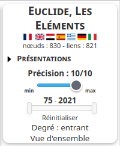
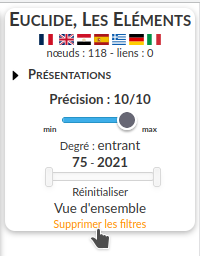

.. include:: substitutions.rst

Menu global
###########

.. cssclass:: centered-image

- “Présentations” donne accès à divers textes de présentation du graphe :
        - Aide : cette page ;
        - Présentation scientifique : exposé des principes sur lesquels le graphe est fondé ;
        - Mots-clefs : liste des mot-clefs avec leur définition ;
        - Typologie des choix : présentation de la typologie des textes fondée sur les choix dont ils procèdent utilisée dans certaines notices ;
        - Typologie des dépendances : présentation de la typologie des textes fondée sur leurs dépendances et indépendances à leurs sources utilisée dans certaines notices ;
        - Contact : pour contacter les auteurs ;
- Le curseur de précision fait varier la vue en fonction du nombre  (par rapport au maximum) de liens entrants, sortants ou les deux.
- Le double curseur suivant adapte la vue à une période donnée.
- Réinitialiser : réinitialise la période de la vue
- “Supprimer les filtres” : supprime un filtre appliqué. Montre tous les nœuds.

Curseur de précision et degrés des nœuds
========================================

   Règle les nœuds montrés selon le degré de leurs liens entrants

Le curseur fait varier les nœuds en fonction du nombre de liens qu'ils ont entants (pour lesquels ils sont en but), sortants (pour lesquels ils sont en source) ou mixtes (les deux).

   Cliquer sur l'orientation pour la modifier

   Restriction des nœuds montrés suivant leur nombre de liens entrants

   Restriction des nœuds montrés suivant leur nombre de liens sortants

On remarque, par exemple, que l'édition de Théon, qui n'a aucun lien sortants, n'apparaît plus.

Le degré d'un nœud pour l'orientation choisie est donné dans le menu local.

.. figure:: _static/images/fr/menu_local_degre_entrant.png
   :align: center

   Degré entrant du Vat. 1051

.. figure:: _static/images/fr/menu_local_degre_mixte.png
   :align: center

   Degré mixte du Vat. 1051

.. figure:: _static/images/fr/menu_local_degre_sortant.png
   :align: center

   Degré sortant du Vat. 1051

Si l'on modifie le voisinage, en masquant par exemple l'Ambros. C 311 inf., le degré mixte et entrant sont modifiés :

.. figure:: _static/images/fr/menu_local_degre_mixte_modifie.png
   :align: center

   Degré mixte modifié du Vat. 1051

Les degrés d'un nœud sont mis à jour lors du changement d'orientation (entrant, mixte, sortant) ou en cliquant sur "Degré" :

.. figure:: _static/images/fr/menu_info_degre_pointeur.png
   :align: center

   Degré mixte modifié du Vat. 1051

Curseur des années
==================

   Encadrement des années des nœuds visibles

   Années des nœuds visibles comprises entre814 et 1462

Supprimer les filtres
=====================

   Suppression des filtres

Apparaît quand un filtre est appliqué.