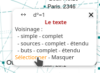
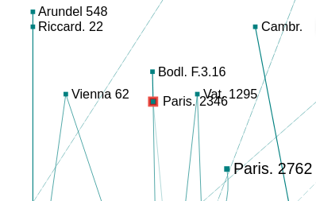
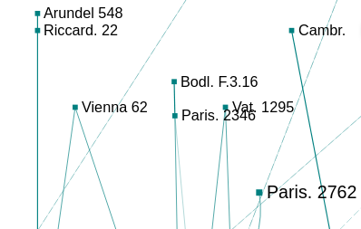
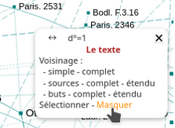
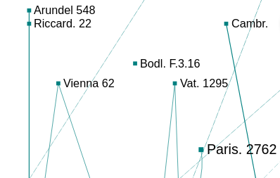

.. include:: substitutions.rst

.. _menu_local: menu local

Menu local
==========
.. image:: _static/images/fr/menu_local.png
    :align: center

Passer la souris sur un nœud fait apparaître un menu contextuel qui permet d’accéder au texte en ligne (Le texte) et d’en montrer divers voisinages :

Voisinages
----------

.. figure:: _static/images/fr/menu_ref_voisinages.png
   :align: center

   Voisinages proposés d'un nœud

- le **voisinage simple** : éditions directement liées au nœud ;
.. figure:: _static/images/fr/voisinage_simple_Clavius.png
   :align: center

   Voisinage simple de Clavius 1574

- le **voisinage complet** : éditions directement liées au nœud avec leurs liens mutuels ;
.. figure:: _static/images/fr/voisinage_simple_complet_Clavius.png
   :align: center

   Voisinage complet de Clavius 1574

- le **voisinage en buts** : éditions en position de but pour le lien ;

.. figure:: _static/images/fr/voisinage_buts_Clavius.png
   :align: center

   Voisinage en butb de Clavius 1574

- le **voisinage en buts complet** : éditions en position de but avec leurs liens mutuels ;
.. figure:: _static/images/fr/voisinage_buts_complet_Clavius.png
   :align: center

   Voisinage en buts complet de Clavius 1574

- le **voisinage en buts étendu** : éditions en position de but, éditions en position de but de ces éditions, etc. ;

.. figure:: _static/images/fr/voisinage_buts_etendu_Clavius.png
   :align: center

   Voisinage en buts étendu de Clavius 1574 (partiel)

- le **voisinage en sources** : éditions en position de source pour le lien ;
.. figure:: _static/images/fr/voisinage_sources_Clavius.png
   :align: center

   Voisinage en sources de Clavius 1574

- le **voisinage en sources complet** : éditions en position de source avec leurs liens mutuels ;
.. figure:: _static/images/fr/voisinage_sources_complet_Candalle.png
   :align: center

   Voisinage en sources complet de Candalle 1566

- le **voisinage en sources étendu** : éditions en position de source, éditions en position de source de ces éditions, etc. ;

.. figure:: _static/images/fr/voisinage_sources_etendu_Clavius.png
   :align: center

   Voisinage en sources étendu de Clavius 1574

Sélectionner - Masquer
----------------------

|arrow|

   Sélection d'un nœud

Si le nœud est déjà sélectionné, cliquer sur "Sélectionner" pour le dé-sélectionner.

|arrow|

   Dé-sélection d'un nœud

|arrow|

   Masquer un nœud

