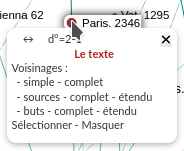
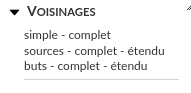
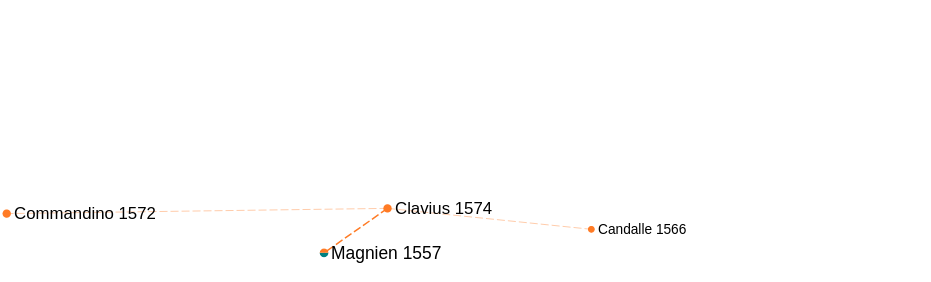
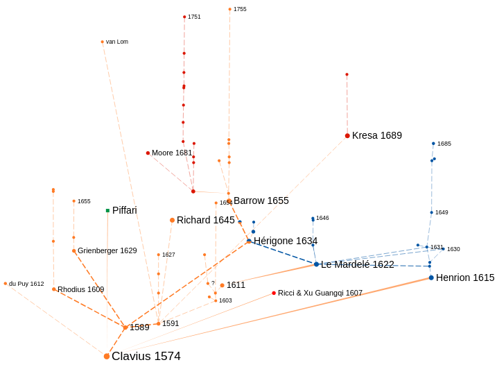

.. include:: substitutions.rst

.. |harr| image:: _static/images/fr/harr.png

.. _menu_local: menu local

Menu local
==========

Passer la souris sur un nœud fait apparaître un menu contextuel qui permet d’accéder au texte en ligne (Le texte) et d’en montrer divers voisinages :

navigation |harr|
-----------------
.. figure:: _static/images/fr/menu_local_navigation.png
   :align: center

   Navigation à partir de la référence

.. figure:: _static/images/fr/menu_local_navigation_output.png
   :align: center

   Références enregistrées dans Thamous en but et en source du *Paris*. 2346

Cliquer sur une de ces références pour afficher ses références en but et en source :

.. figure:: _static/images/fr/menu_local_navigation_output_pointeur.png
   :align: center

   Sélection d'une autre référence

.. figure:: _static/images/fr/menu_local_navigation_Heiberg_1903.png
   :align: center

   Références enregistrées dans Thamous en but et en source de Heiberg, J.L., "Paralipomena zu Euklid", 1903

degré (d°)
----------

.. figure:: _static/images/fr/menu_local_degre.png
   :align: center

   Degré sortant (2) et entrant (1) du *Paris*. 2346

Ne sont pris en compte que les nœuds visibles.

.. figure:: _static/images/fr/menu_local_degre_modifie.png
   :align: center

   Degré sortant (1) et entrant (1) du *Paris*. 2346 (*Ottob*. 310 masqué)

Le texte
--------

.. figure:: _static/images/fr/menu_local_texte.png
   :align: center

   Accès au texte en ligne

Voisinages
----------

   Voisinages proposés d'un nœud

- le **voisinage simple** : éditions directement liées au nœud ;
.. figure:: _static/images/fr/voisinage_simple_Clavius.png
   :align: center

   Voisinage simple de Clavius 1574

- le **voisinage complet** : éditions directement liées au nœud avec leurs liens mutuels ;
.. figure:: _static/images/fr/voisinage_simple_complet_Clavius.png
   :align: center

   Voisinage complet de Clavius 1574

- le **voisinage en buts** : éditions en position de but pour le lien ;

   Voisinage en butb de Clavius 1574

- le **voisinage en buts complet** : éditions en position de but avec leurs liens mutuels ;
.. figure:: _static/images/fr/voisinage_buts_complet_Clavius.png
   :align: center

   Voisinage en buts complet de Clavius 1574

- le **voisinage en buts étendu** : éditions en position de but, éditions en position de but de ces éditions, etc. ;

.. figure:: _static/images/fr/voisinage_buts_etendu_Clavius.png
   :align: center

   Voisinage en buts étendu de Clavius 1574 (partiel)

- le **voisinage en sources** : éditions en position de source pour le lien ;
.. figure:: _static/images/fr/voisinage_sources_Clavius.png
   :align: center

   Voisinage en sources de Clavius 1574

- le **voisinage en sources complet** : éditions en position de source avec leurs liens mutuels ;
.. figure:: _static/images/fr/voisinage_sources_complet_Candalle.png
   :align: center

   Voisinage en sources complet de Candalle 1566

- le **voisinage en sources étendu** : éditions en position de source, éditions en position de source de ces éditions, etc. ;

   Voisinage en sources étendu de Clavius 1574

Sélectionner - Masquer
----------------------

|arrow|

.. figure:: _static/images/fr/menu_local_selectionner_resultat.png
   :align: center

   Sélection d'un nœud

Si le nœud est déjà sélectionné, cliquer sur "Sélectionner" pour le dé-sélectionner.

|arrow|

   Dé-sélection d'un nœud

|arrow|

   Masquer un nœud

