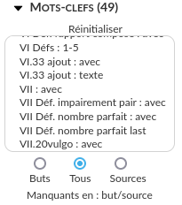
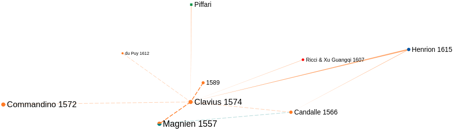

.. include:: substitutions.rst

.. role:: firebrick
   :class: txt-firebrick

Informations sur un nœud
========================

Le bandeau à gauche associé à chaque texte comprend :

- les auteurs, le titre, le lieu d’édition, l’éditeur, l’année de composition ou d’impression, la ou les langues du texte ;

- une reproduction d’une page pour les manuscrits et de la page de titre pour les imprimés ;

- une ou plusieurs url donnant accès au texte en ligne (quand elle existe) ;

- un cadre pour délimiter les limites du graphe ;

- min - max : prend la date de la référence comme borne minimale (resp. maximale) de la vue ;

- des mots-clefs et diverses fonctionnalités associées ;

- la possibilité de montrer divers voisinages du noeud ;
.. image:: _static/images/fr/menu_ref_voisinages.png
   :align: center

- des textes s’y rapportant (“présentation de”, “cite”, “remarques sur”, “études sur”, “traduction”, etc.) (références en “sources”, sélectionnées par défaut)

Informations sur une référence et recherches associées
------------------------------------------------------

Plusieurs éléments sont cliquables et permettent de sélectionner les nœuds ayant la même valeur.

.. figure:: _static/images/fr/menu_ref_recherche_nom.png
   :align: center

   Textes attribués à Campanus

   Éditions publiées dans la même ville que Campanus 1482

   Textes dans la même langue que Campanus 1482

   Textes dans la même langue que le Paris. 2346

   Éditions publiées la même année que Briggs 1620

Pour dé-sélectionner les nœuds sélectionner :

   Pour dé-sélectionner les nœuds sélectionnés

Urls associées à une référence

   Accéder à un texte en ligne

Cadre délimitant la vue du graphe

   Délimitation de la partie visible du graphe

   Vue du graphe en prenant le Paris. 2346 comme bord supérieur

   Vue du graphe en prenant le Paris. 2346 comme bord gauche

   Vue du graphe en prenant le Paris. 2346 comme bord droit

   Vue du graphe en prenant le Paris. 2346 comme angle supérieur droit

.. _ref mots-clefs:
Mots-clefs
----------

   Mots-clefs d’une référence (Paris. 2346)

Plusieurs fonctionnalités sont associées à chaque mot-clef :

   Sélection d'un mot-clef

Cliquer sur un mot-clef sélectionne les nœuds avec le mot-clef. Le mot-clef sélectionné est coché et apparaît en vert :

   Noeuds avec le mot-clef D6-NC10

Cliquer à nouveau sur le mot-clef clef le dé-sélectionne.

Ctrl+Clique affiche la définition du mot-clef :

   Définition d’un mot-clef (Ctrl + Clique)

Plusieurs mot-clefs peuvent être sélectionnés simultanément. Les noeuds sélectionnés sont ceux qui ont tous les mots-clefs sélectionnés.

   Nœuds avec les mot-clefs D5=D, D6-NC10, D6=D

Shift + clique sur le mot-clef sélectionne les nœuds n’ayant pas le mot-clef sélectionné.

   Nœuds n’ayant pas le mot-clef D6-NC10 (Shift + clique)

Les deux modes de sélection peuvent être combinés :

   Nœuds n’ayant pas le mot-clef D6-NC10 mais ayant le mot-clefs D6=D

Réinitialiser
-------------

   Réinitialisation des mots-clefs sélectionnés

Buts - Tous - Sources
---------------------
Il est possible de restreindre les nœuds sélectionnés à ceux qui sont en source ou en but du nœud considéré.

   Nœuds avec le mot-clef D6-NC10 en but du Paris. 2346

Manquants en but/source
-----------------------

“Manquants en : but” sélectionne en rouge les mots-clefs du nœud sélectionné qui manquent à l'un de ses nœuds en but. Ce sont les mots-clefs innovants de la sélection, c'est-à-dire les mots-clefs qui ne sont pas dans ses modèles.

   Mots-clefs innovants du Paris. 2346

“Manquants en : source” sélectionne en rouge les mots-clefs du nœud sélectionné qui manquent à l'un de ses nœuds en source. Ce sont les mots-clefs orphelins de la sélection, c'est-à-dire les mots-clefs qui n'ont pas été repris dans les textes qui l'ont pris comme modèle.

Voisinages
----------
.. figure:: _static/images/fr/menu_ref_voisinages.png
   :align: center

   Voisinages proposés d'un nœud

   Voisinage simple de Clavius 1574

   Voisinage complet de Clavius 1574

.. figure:: _static/images/fr/voisinage_buts_Clavius.png
   :align: center

   Voisinage en but de Clavius 1574

   Voisinage en but complet de Clavius 1574

   Voisinage en but étendu de Clavius 1574 (partiel)

   Voisinage en source de Clavius 1574

.. figure:: _static/images/fr/voisinage_sources_complet_Candalle.png
   :align: center

   Voisinage en source complet de Candalle 1566

.. figure:: _static/images/fr/voisinage_sources_etendu_Clavius.png
   :align: center

   Voisinage en source étendu de Clavius 1574

Bibliographie
-------------
A chaque nœud est associé un ensemble de références distinguées suivant le type de leur lien au noeud et leur position (en source ou en but).

Biblio - Personnes - Institutions
^^^^^^^^^^^^^^^^^^^^^^^^^^^^^^^^^
Les références peuvent être de 3 types : bibliographiques (Biblio), des personnes (Personnes) ou des institutions (Institutions). La plupart sont des références bibliographiques qui est pour cette raison le choix par défaut.

Buts - Sources
^^^^^^^^^^^^^^
Les références bibliographiques données (voir ci-dessous) sont par défaut les références en source, c’est-à-dire celles qui portent sur le texte considéré. Il est possible d’afficher aussi les référence en but, c’est-à-dire les références auxquelles se rapporte le texte considéré.

Cliquer sur un type de lien fait apparaître la liste des références en source d’un lien du type considéré. Ici les références faisant des “remarques sur” l’édition de Campanus.

@ : indique une référence accessible en ligne.

↔: ouvre une fenêtre faisant apparaître toutes les références en but et en source permettant de naviguer entre ces références;

rmqs : affiche des remarques de la référence sur l’édition considérée.

