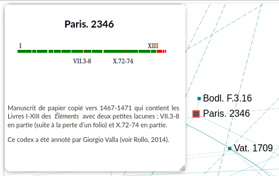
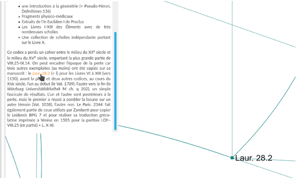

Notice d'un nœud
================

.. _notice noeud:

**Cliquer une fois** sur un **nœud** pour faire apparaître sa notice.

**Cliquer sur le fond** du graphe pour masquer la notice.

**Cliquer** sur une édition mentionnée dans une notice zoome sur le nœud de l’édition et permet de le trouver dans le graphe.

